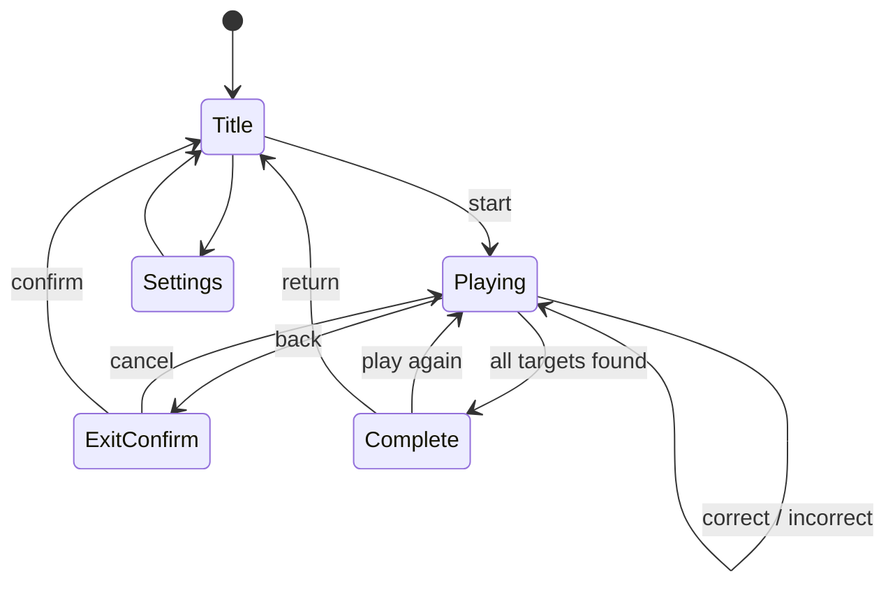

# Component and domain design

Status: Approved on 2026-08-18

## UI components

| Component | Responsibility |
|---|---|
| `App` | 保存状態の復元、画面状態、全体イベントの調停 |
| `TitleScreen` | 難易度・サイズ選択、累計表示、開始、設定への遷移 |
| `GameScreen` | ゲーム進行、戻る確認、盤面と探索対象の配置 |
| `WordGrid` | 文字盤面、Pointer Events、仮選択、発見済み色 |
| `TargetList` | 探す名前、発見済み色、打ち消し線 |
| `CompletionScreen` | 今回の発見数、累計、再プレイ、タイトル遷移 |
| `SettingsScreen` | 効果音切替、累計表示、リセット確認 |
| `ConfirmDialog` | ゲーム終了と記録リセットの確認 |
| `Confetti` | 正解時およびクリア時の軽量演出 |

## Domain modules

| Module | Responsibility |
|---|---|
| `pokemonCatalog` | 収録名、表示名、正規化名、世代・必須枠メタデータ |
| `gameConfig` | 盤面プリセット、探索数、方向集合、生成上限 |
| `nameNormalizer` | 小書き文字の大書き化、使用可能文字、長さ計算 |
| `puzzleGenerator` | 対象抽選、配置、交差、空きマス補完、再試行 |
| `puzzleValidator` | 対象の一意出現、範囲、文字一致、設定整合性の検証 |
| `selectionResolver` | 始点・現在位置から許可方向へスナップし、選択経路を算出 |
| `gameReducer` | 発見、誤選択、クリア、再開に関する状態遷移 |
| `gameStorage` | バージョン付き保存データの読込、保存、移行、破棄 |
| `soundEffects` | ユーザー操作後のAudioContext開始と短い効果音生成 |

## Core domain types

```text
Coordinate      = row + column
Direction       = deltaRow + deltaColumn
PlacedWord      = pokemonId + start + direction + cells
Puzzle          = size + difficulty + grid + targets + placements
GameSession     = puzzle + foundIds + foundOrder + status
PlayerRecord    = totalFound + soundEnabled + lastSelection
PersistedState  = schemaVersion + record + activeSession?
```

## State flow


