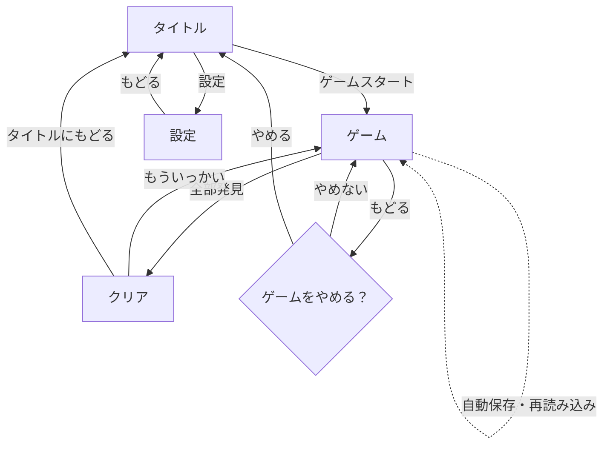

# Interaction specification

Status: Approved on 2026-08-18

## Screen flow

## Title screen

- ゲーム名
- 発見回数の累計
- 難易度の2択
- 盤面サイズの5択。各選択肢には盤面寸法と探索数を併記
- 「ゲームスタート」を最も強い操作として表示
- 「設定」を副操作として表示

## Game screen

- 左上: 「もどる」
- 上部: 現在の発見数 / 探索対象数
- 中央: 正方形の文字盤面
- 下部: 探索対象名の一覧
- 正解箇所と対象名は同じ色で対応
- なぞり中は指の移動に合わせて一時選択を更新

## Completion screen

- 大きなクリアメッセージと紙吹雪
- 今回集めた数
- 発見回数の累計
- 主操作: 「もういっかい」
- 副操作: 「タイトルにもどる」

## Settings screen

- 効果音のオン・オフ
- 発見回数の累計表示
- 累計リセット
- リセット確認ダイアログ

## Confirmation dialogs

- ゲーム終了確認: 「ゲームをやめる？」／「やめない」／「やめる」
- 累計リセット確認: 「あつめた きろくを けす？」／「けさない」／「けす」
