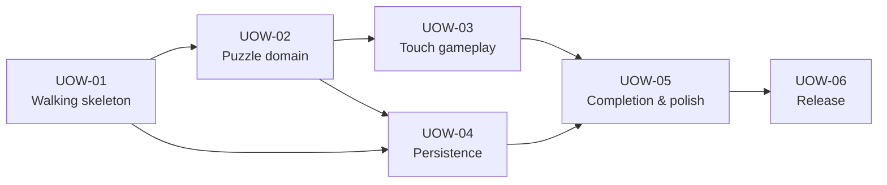

# Unit of work dependencies

## Dependency rationale

- UOW-01 establishes types, scripts, UI shell, and configuration conventions.
- UOW-02 defines the final Puzzle and placement contracts consumed by gameplay and persistence.
- UOW-03 and UOW-04 can proceed as a parallel batch after UOW-02.
- UOW-05 integrates gameplay, saved state, effects, and final responsive UI.
- UOW-06 validates and deploys the complete product.

